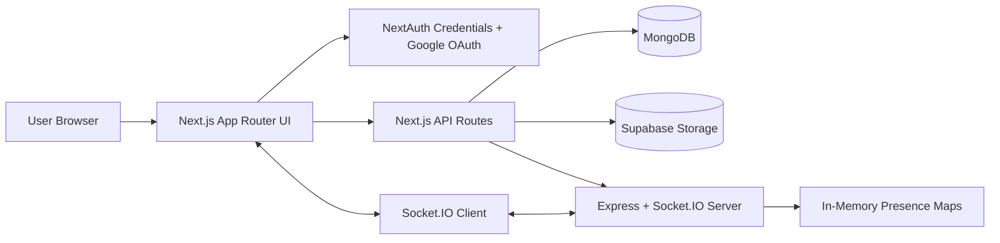
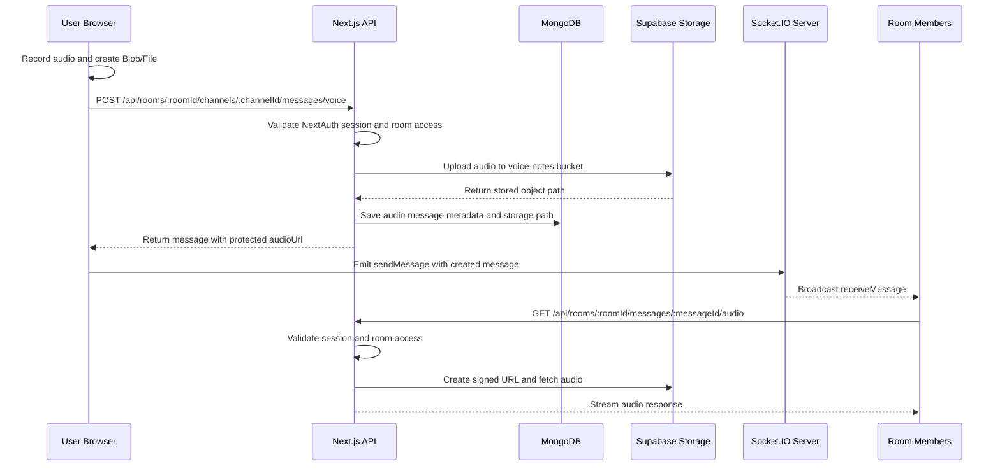

# WorkspaceOne


WorkspaceOne is a full-stack real-time collaboration and communication platform built for room-based teamwork. It combines authenticated workspaces, persistent messaging, live Socket.IO updates, online presence, role-based member management, announcements, tasks, resources, notifications, message moderation, and voice-message support through Supabase Storage.

The project is organized as a Next.js App Router application for the frontend, authentication, API routes, and MongoDB persistence, plus a separate Express and Socket.IO service for realtime communication. This separation makes the application practical for production-style deployment, with the frontend/API layer deployable to Vercel and the Socket.IO server deployable to Render.

## Features

### 🔐 Authentication and Access

- Credentials-based registration and login with hashed passwords
- Google OAuth login through NextAuth
- JWT-backed NextAuth sessions
- Server-side protected dashboard and room pages
- API-level session checks with `getServerSession`
- Room-scoped authorization using `admin`, `moderator`, and `member` roles

### 💬 Realtime Messaging

- Room-based live chat
- Channel-scoped messaging
- Persistent MongoDB chat history
- Text messages and reply previews
- Message pinning for admins and moderators
- Message deletion for admins and moderators
- Realtime Socket.IO message broadcast

### 🎙️ Voice Messages

- Browser-recorded audio upload endpoint
- Supabase Storage upload using a server-side Supabase admin client
- Voice-note metadata persisted in MongoDB
- API-proxied playback endpoint with signed Supabase URLs
- Audio range-header passthrough for streaming playback

### 🧑‍🤝‍🧑 Rooms and Members

- Room creation with generated 6-character room codes
- Join-by-code workflow
- Default `general` channel creation for new rooms
- Member list with online/offline awareness
- Admin-only role updates
- Admin/moderator member removal rules
- Last-seen tracking for unread counts

### 🔔 Notifications and Announcements

- Persistent notification model
- Notification bell provider and UI
- Realtime notification fanout through the Socket.IO server
- Presence-aware notification creation that skips users active in the room
- Admin/moderator announcements
- Dashboard notification events for replies, announcements, joins, removals, and new messages

### ✅ Workspace Modules

- Task creation, assignment, status, due date, and priority support
- Resource sharing for files and links
- Dedicated room pages for chat, members, resources, and tasks
- Responsive UI styles for dashboard, login, landing, sidebars, and chat

## Tech Stack

| Layer | Technology |
| --- | --- |
| Frontend | Next.js 16 App Router, React 19, CSS, Tailwind CSS package present |
| Backend | Next.js API Routes, Node.js, Express |
| Database | MongoDB with Mongoose |
| Authentication | NextAuth.js, Credentials Provider, Google OAuth, bcrypt |
| Realtime Communication | Socket.IO server, Socket.IO client |
| Storage | Supabase Storage for voice-note audio files |
| Deployment | Frontend/API intended for Vercel; Socket.IO server intended for Render |

## Architecture Overview

1. Users register through `/api/register` or sign in through NextAuth using credentials or Google OAuth.
2. Authenticated users create rooms through `/api/rooms`; the creator becomes the room `admin`, and a default `general` channel is created.
3. Users join rooms by submitting a 6-character code to `/api/rooms/join`.
4. Messages are stored in MongoDB through room or channel message API routes.
5. The frontend connects to the separate Socket.IO server through `NEXT_PUBLIC_SOCKET_SERVER_URL`.
6. Socket.IO handles room joins, live message broadcasts, presence snapshots, dashboard notifications, pin/delete events, role updates, and member removal events.
7. Voice messages are uploaded by the Next.js API to the `voice-notes` Supabase bucket, while audio metadata and storage paths are saved in MongoDB.
8. Audio playback is served through a protected Next.js API route that checks room access, creates a signed Supabase URL, and streams the response.



## Project Structure

```text
Chat-Application/
|-- README.md
|-- backend/
|   |-- .env
|   |-- package.json
|   |-- package-lock.json
|   `-- server.js
`-- frontend/
    |-- .env.local
    |-- package.json
    |-- package-lock.json
    |-- next.config.ts
    |-- tsconfig.json
    |-- eslint.config.mjs
    |-- postcss.config.mjs
    |-- app/
    |   |-- api/
    |   |-- chat/
    |   |-- dashboard/
    |   |-- login/
    |   |-- register/
    |   |-- room/
    |   |-- styles/
    |   |-- globals.css
    |   |-- layout.jsx
    |   `-- page.jsx
    |-- components/
    |-- lib/
    |-- models/
    |-- providers/
    `-- public/
```

<details>
<summary>Source folders</summary>

| Folder | Purpose |
| --- | --- |
| `frontend/app` | Next.js App Router pages, layouts, styles, and API routes |
| `frontend/app/api` | Server-side API endpoints for auth, rooms, messages, members, notifications, resources, tasks, and audio |
| `frontend/models` | Mongoose schemas and models |
| `frontend/lib` | Database, room-role, notification, Socket.IO, Supabase, and message-media helpers |
| `frontend/providers` | Client providers for authentication and notifications |
| `frontend/components` | Shared React components |
| `backend` | Express and Socket.IO realtime server |

</details>

## Installation

### Clone Repository

```bash
git clone <repository-url>
cd Chat-Application
```

### Install Dependencies

There is no root `package.json` in the inspected workspace. Install dependencies separately:

```bash
cd frontend
npm install

cd ../backend
npm install
```

### Environment Variables

Create `frontend/.env.local` for the Next.js application and `backend/.env` for the Socket.IO server.

| Variable | Used by | Description |
| --- | --- | --- |
| `MONGODB_URI` | Frontend/API | MongoDB connection string used by Mongoose |
| `NEXTAUTH_SECRET` | Frontend/API | Secret used by NextAuth session/JWT handling |
| `NEXTAUTH_URL` | Frontend/API | NextAuth site URL; present in local env, direct code usage not found |
| `GOOGLE_CLIENT_ID` | Frontend/API | Google OAuth client ID |
| `GOOGLE_CLIENT_SECRET` | Frontend/API | Google OAuth client secret |
| `NEXT_PUBLIC_SUPABASE_URL` | Frontend/API | Supabase project URL used to create the server-side Supabase client |
| `NEXT_PUBLIC_SUPABASE_ANON_KEY` | Frontend/API | Present in local env; direct code usage not found, to be verified |
| `SUPABASE_SERVICE_ROLE_KEY` | Frontend/API | Supabase service role key used server-side for voice-note uploads and signed URLs |
| `NEXT_PUBLIC_SOCKET_SERVER_URL` | Frontend/API | Public URL for the Socket.IO server; defaults to `http://localhost:5000` when unset |
| `SOCKET_SERVER_SECRET` | Frontend/API and Backend | Optional shared secret for server-to-server Socket.IO HTTP endpoints |
| `CLIENT_URL` | Backend | Comma-separated allowed frontend origins for CORS; defaults to `*` when unset |
| `PORT` | Backend | Socket.IO server port; defaults to `5000` when unset |

## Running Locally

Run the Socket.IO server and Next.js app in separate terminals.

### 1. Start Socket.IO Server

```bash
cd backend
node server.js
```

Optional development mode:

```bash
cd backend
npx nodemon server.js
```

The Socket.IO server defaults to `http://localhost:5000`.

### 2. Start Next.js App

```bash
cd frontend
npm run dev
```

Open `http://localhost:3000`.

### Available Scripts

| Location | Command | Purpose |
| --- | --- | --- |
| `frontend` | `npm run dev` | Start the Next.js development server |
| `frontend` | `npm run build` | Create a production build |
| `frontend` | `npm run start` | Start the production Next.js server |
| `frontend` | `npm run lint` | Run ESLint |
| `backend` | `npm test` | Placeholder script that exits with an error |


## Voice Message Flow

User Records Audio  
→ Browser Creates Blob  
→ Upload to Supabase Storage through Next.js API  
→ Receive Storage Path/API Playback URL  
→ Store Message Metadata in MongoDB  
→ Emit Through Socket.IO  
→ Display in Chat  
→ Retrieve and Stream Audio through Protected API Route



## Database Models

| Model | Key Fields | Relationships and Purpose |
| --- | --- | --- |
| `User` | `name`, `email`, `password`, `image` | Stores credentials users and Google OAuth users; referenced by rooms, messages, notifications, resources, and tasks |
| `Room` | `name`, `code`, `createdBy`, `members[]` | Workspace/room entity; `createdBy` references `User`; members contain `userId`, `role`, `joinedAt`, and `lastSeen` |
| `Channel` | `workspaceId`, `name`, `createdBy` | Room channel; `workspaceId` references `Room`, `createdBy` references `User` |
| `Message` | `roomId`, `channelId`, `senderId`, `message`, `messageType`, `audioPath`, `type`, `isPinned`, `replyTo`, `time` | Stores text messages, announcements, replies, pinned state, deletion target data, and audio metadata |
| `Notification` | `recipientId`, `senderId`, `roomId`, `actionType`, `entityId`, `entityType`, `previewText`, `link`, `readAt` | Persistent notification feed for room events |
| `Resource` | `roomId`, `type`, `url`, `name`, `uploadedBy` | Room resources for links/files |
| `Task` | `roomId`, `title`, `description`, `dueDate`, `priority`, `status`, `assignedTo`, `createdBy` | Room task management with assignment and status tracking |

## API Routes

| Route | Method | Purpose |
| --- | --- | --- |
| `/api/auth/[...nextauth]` | `GET`, `POST` | NextAuth handler for credentials and Google OAuth authentication |
| `/api/register` | `POST` | Register a credentials user with bcrypt password hashing |
| `/api/rooms` | `GET` | List rooms for the authenticated user |
| `/api/rooms` | `POST` | Create a room and default `general` channel |
| `/api/rooms/join` | `POST` | Join a room by 6-character room code |
| `/api/rooms/:roomId` | `DELETE` | Delete a room; admin only |
| `/api/room/:roomId` | `DELETE` | Delete a room; admin only duplicate route |
| `/api/rooms/:roomId/members` | `GET` | Return room members, current user role, and member-management permissions |
| `/api/room/promote` | `PATCH` | Update a member role; admin only |
| `/api/room/remove-user` | `DELETE` | Remove a member according to admin/moderator rules |
| `/api/room/last-seen` | `PATCH` | Update the authenticated user's last-seen timestamp for a room |
| `/api/room/unread` | `GET` | Return unread message counts based on room member `lastSeen` timestamps |
| `/api/rooms/:roomId/channels` | `GET` | List channels in a room |
| `/api/rooms/:roomId/channels` | `POST` | Create a channel; comment indicates admin-only behavior |
| `/api/rooms/:roomId/messages` | `GET` | Return room messages with audio playback URLs where applicable |
| `/api/rooms/:roomId/messages` | `POST` | Create a room-scoped text message and notifications |
| `/api/rooms/:roomId/messages/:messageId` | `DELETE` | Delete a message; admin or moderator only |
| `/api/rooms/:roomId/messages/:messageId/audio` | `GET` | Protected audio streaming endpoint for voice messages |
| `/api/rooms/:roomId/channels/:channelId/messages` | `GET` | Return messages for a specific channel |
| `/api/rooms/:roomId/channels/:channelId/messages` | `POST` | Create a text message in a specific channel |
| `/api/rooms/:roomId/channels/:channelId/messages/voice` | `POST` | Upload a voice message to Supabase and persist audio metadata |
| `/api/message/pin` | `PATCH` | Pin or unpin a message; admin or moderator only |
| `/api/announcement` | `POST` | Create an announcement; admin or moderator only |
| `/api/notifications` | `GET` | Return notifications for the authenticated user |
| `/api/notifications/:notificationId/read` | `PATCH` | Mark one notification as read |
| `/api/notifications/read-all` | `PATCH` | Mark all notifications as read |
| `/api/rooms/:roomId/resources` | `GET` | List room resources |
| `/api/rooms/:roomId/resources` | `POST` | Create a file/link resource |
| `/api/rooms/:roomId/tasks` | `GET` | List room tasks |
| `/api/rooms/:roomId/tasks` | `POST` | Create a room task |
| `/api/rooms/:roomId/tasks/:taskId` | `PATCH` | Update a task; includes role and assignee checks |
| `/api/rooms/:roomId/tasks/:taskId` | `DELETE` | Delete a task |

## Socket.IO Server

| Event or Endpoint | Direction | Purpose |
| --- | --- | --- |
| `registerUser` | Client to server | Register the user's personal socket room |
| `joinRoom` | Client to server | Join a room and update online presence |
| `leaveRoom` | Client to server | Leave a room and update online presence |
| `roomUsers` | Server to room | Broadcast current online users for a room |
| `sendMessage` | Client to server | Broadcast a message to room members |
| `receiveMessage` | Server to room | Deliver realtime messages |
| `announcementCreated` | Client to server | Broadcast announcement data and notification events |
| `messagePinned` | Client to server | Broadcast pin state changes |
| `messageDeleted` | Client to server | Broadcast deleted message IDs |
| `roleUpdated` | Client to server | Broadcast role changes |
| `userRemoved` | Client to server | Broadcast member removal |
| `dashboardNotification` | Server to clients | Broadcast dashboard-level notification events |
| `notificationCreated` | Server to user room | Deliver persisted realtime notifications to a specific user |
| `GET /presence/rooms/:roomId/users` | API to socket server | Return active user IDs for a room; optional shared-secret protected |
| `POST /emit/notifications` | API to socket server | Fan out persisted notifications to recipient socket rooms; optional shared-secret protected |

## Security Features

- Authentication is handled by NextAuth with Credentials and Google OAuth providers.
- Password registration uses `bcrypt.hash(password, 10)`.
- Credentials login validates passwords with `bcrypt.compare`.
- Sessions use the NextAuth JWT strategy.
- Protected pages and APIs call `getServerSession(authOptions)`.
- Room APIs verify membership and roles through shared room-role helpers.
- Admin/moderator permissions protect announcements, message pinning, message deletion, and member-management actions.
- Supabase service role access is kept server-side in API routes and helper modules.
- Voice playback validates room access before generating signed Supabase URLs.
- Socket server HTTP endpoints can be protected with `SOCKET_SERVER_SECRET`.
- CORS for the Socket.IO server is configurable through `CLIENT_URL`.

To be verified: Supabase bucket policies and production OAuth callback URLs are not represented by checked-in configuration files.

## Future Improvements

- Add `start` and `dev` scripts to `backend/package.json`.
- Add automated tests for auth, room roles, message persistence, and voice-message upload/playback.
- Add checked-in deployment examples such as `vercel.json`, `render.yaml`, or documented dashboard screenshots.
- Add rate limiting for auth, room joining, message creation, and uploads.
- Add file-size and duration limits for voice messages.
- Add Socket.IO authentication middleware tied to NextAuth sessions.
- Add optimistic UI reconciliation for message send failures.
- Add structured API documentation with request/response examples.
- Add CI for linting and production build validation.

## Screenshots

> Screenshots are placeholders and should be replaced with current production UI captures.

| Dashboard | Room Chat |
| --- | --- |
| `docs/screenshots/dashboard.png` | `docs/screenshots/room-chat.png` |

| Members | Voice Message |
| --- | --- |
| `docs/screenshots/members.png` | `docs/screenshots/voice-message.png` |

## Author

**Zainab Jambughodawala**  
B.Tech Computer Science and Design  
IEEE Secretary | Full Stack Developer

## License

This project is licensed under the MIT License.

```text
MIT License

Copyright (c) 2026 Zainab Jambughodawala

Permission is hereby granted, free of charge, to any person obtaining a copy
of this software and associated documentation files (the "Software"), to deal
in the Software without restriction, including without limitation the rights
to use, copy, modify, merge, publish, distribute, sublicense, and/or sell
copies of the Software, and to permit persons to whom the Software is
furnished to do so, subject to the following conditions:

The above copyright notice and this permission notice shall be included in all
copies or substantial portions of the Software.

THE SOFTWARE IS PROVIDED "AS IS", WITHOUT WARRANTY OF ANY KIND, EXPRESS OR
IMPLIED, INCLUDING BUT NOT LIMITED TO THE WARRANTIES OF MERCHANTABILITY,
FITNESS FOR A PARTICULAR PURPOSE AND NONINFRINGEMENT. IN NO EVENT SHALL THE
AUTHORS OR COPYRIGHT HOLDERS BE LIABLE FOR ANY CLAIM, DAMAGES OR OTHER
LIABILITY, WHETHER IN AN ACTION OF CONTRACT, TORT OR OTHERWISE, ARISING FROM,
OUT OF OR IN CONNECTION WITH THE SOFTWARE OR THE USE OR OTHER DEALINGS IN THE
SOFTWARE.
```
